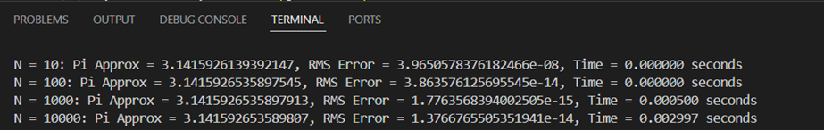

# Tugas Implementasi Integrasi Numerik
## Deskripsi
Merupakan implementasi kode untuk permasalahan Integrasi Numerik untuk menghitung nilai Pi yang dibuat dengan bahasa Python. Berisikan 1 metode penyelesaian yaitu: 
- Metode Simpson 1/3  

## Hasil
### Metode Simpson 1/3

